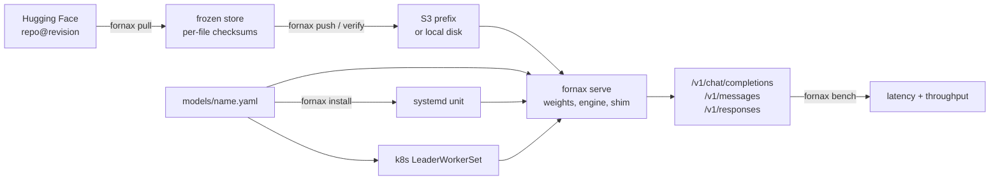

# Fornax

[](https://github.com/latere-ai/fornax/actions/workflows/ci.yml)
[](go.mod)
[](LICENSE)

Run open-weight models on GPUs you control, end to end. One Go binary
freezes the weights, starts the inference engine, serves OpenAI Chat,
Anthropic Messages, and OpenAI Responses endpoints behind a health
contract, and measures what came up.

Two deploy modes share one manifest schema and one serving contract:
Kubernetes for a multi-GPU fleet, and an installed binary under systemd
for a single-GPU host with no cluster around it.



## Why run it yourself

- **Weight freeze.** Upstream Hugging Face repositories change and
  disappear. Every model is pinned to a revision and checksummed per
  file, then never downloaded from upstream again: into an S3 prefix for
  a fleet, or in place on a host's own disk. `/readyz` does not report
  ready until the weights on disk match the manifest.
- **Cost and control.** At sustained load, your own GPUs cost less than
  per-token router pricing, and they remove third-party rate limits,
  silent model swaps, and data leaving your network.
- **One surface, whatever the caller speaks.** An Anthropic SDK, an
  OpenAI Chat client, and an OpenAI Responses client all reach the same
  endpoint. What a translation between them cannot carry is reported in
  a response header, not dropped silently.
- **A path to post-training.** Weights you hold are the prerequisite for
  fine-tuning or reinforcement learning later.

## Status

Fornax is early. There are no tagged releases and no published images
yet, and the manifest schema, the endpoints, and the command flags may
still change.

- **Works and has served:** the whole command. Weight fetch, freeze, and
  verify; the serving entrypoint with all three caller dialects;
  `fornax bench`; and the bare-metal mode through `fornax install`.
  Qwen3.8-27B serves this way on one GB10 host at full BF16, answering on
  all three dialects including vision, at a measured 3.0 tokens per
  second.
- **Built and checked in CI, not yet served on real hardware:** the
  Kubernetes path. Every checked-in model has a manifest and a
  LeaderWorkerSet that `fornax validate` checks against each other, but
  no model has served on a GPU node yet and the large weight sets are not
  mirrored. The 4-bit Qwen fast path validates and has not served.

## Install

Go 1.27 or newer, no cgo:

```sh
go install latere.ai/x/fornax/cmd/fornax@main
```

`fornax` is one static binary. Some commands call tools you install
beside it:

| Command | Needs on `PATH` |
|---|---|
| `pull`, `push` | [`hf`](https://huggingface.co/docs/huggingface_hub/guides/cli), the Hugging Face command line |
| `push`, `verify`, `list` against `s3://` | [`s5cmd`](https://github.com/peak/s5cmd) |
| `serve` | the engine the manifest names: `vllm`, or `python3` with `sglang` installed |
| `run` | the coding agent you launch: `claude`, `codex`, or `opencode` |

The container images bundle all of this; see the
[deploy guide](docs/deploy.md).

## Quick start

From a checkout, so the manifests under `models/` are at hand. Freeze a
model onto a host's own disk, then serve it:

```sh
git clone https://github.com/latere-ai/fornax.git
cd fornax
go install ./cmd/fornax

fornax pull   Qwen/Qwen3.8-27B@<sha> --dir ~/.models/Qwen/Qwen3.8-27B/<sha>
fornax freeze Qwen/Qwen3.8-27B@<sha> --dir ~/.models/Qwen/Qwen3.8-27B/<sha>
fornax validate models/
fornax serve --manifest models/qwen3.8-27b.yaml --cache-root ~/.models
```

`<sha>` is the 40-character revision the manifest pins. For a fleet, the
weights go to any bucket `s5cmd` can reach (AWS S3, DigitalOcean Spaces,
Cloudflare R2, MinIO), and the same `serve` runs as the container
entrypoint:

```sh
fornax push moonshotai/Kimi-K2.7-Code@<sha> \
    --dir /scratch/kimi --bucket s3://<your-bucket>
fornax verify s3://<your-bucket>/moonshotai/Kimi-K2.7-Code/<sha>/
```

Ask the endpoint anything an OpenAI or Anthropic client can ask, and
measure it:

```sh
curl -s localhost:8000/v1/messages -H 'Content-Type: application/json' \
  -d '{"model":"qwen3.8-27b","max_tokens":64,
       "messages":[{"role":"user","content":"hello"}]}'

fornax bench --url http://localhost:8000 --model qwen3.8-27b \
    --concurrency 8 --requests 32 --out report.json
```

The endpoint has no authentication. Keep it on a private network, or put
a gateway in front of it; see [Security](docs/deploy.md#security).

## Commands

```
weights
  fornax pull     <hf_repo>[@revision] --dir <dir>    fetch from Hugging Face and verify
  fornax freeze   <hf_repo>@<sha> --dir <dir>         write the store manifest in place
  fornax push     <hf_repo>@<sha> --dir <dir> --bucket <root>
  fornax verify   <prefix>                            check a store against its manifest
  fornax list     --bucket <root>                     what is mirrored there

serving
  fornax serve    --manifest <manifest.yaml>          run a model
  fornax validate <models-dir | manifest.yaml>        check manifests and deploy artifacts
  fornax install  --manifest <manifest.yaml>          place the unit and manifest on this host
  fornax ps                                           what is serving on this host
  fornax endpoint --harness <name>                    config to point a coding agent at a model
  fornax run      <harness> [-- args]                 launch that agent against it
  fornax bench    --url <base> --model <id>           measure a live endpoint

  fornax version
```

`fornax <command> -h` prints the flags of a command that has any. A
usage mistake exits 2, a failed operation exits 1.

## Documentation

| Page | For | What it answers |
|---|---|---|
| [Deploy guide](docs/deploy.md) | operators | images, freezing weights, Kubernetes and bare-metal deploys, every manifest field and runtime setting, telemetry, troubleshooting |
| [Models](docs/models.md) | operators and client developers | the checked-in manifests, what each endpoint answers, adding a model |
| [Coding agents](docs/coding-agents.md) | people coding against a served model | pointing Claude Code, Codex, or opencode at a model on a host |
| [Sizing a model for a GPU](docs/practice.md) | operators planning hardware | whether a model fits a machine, and how fast it will be once it does |
| [Development](docs/development.md) | contributors | building from source, the test targets, the repository layout |
| [Specs](specs/README.md) | contributors | the design record behind each decision |

## The checked-in models

The `models/` directory holds the set Latere is bringing up: six
frontier-scale mixture-of-experts models for Kubernetes GPU nodes, and a
dense model in two variants for a single GB10 host, each meant to sit
behind a model gateway such as [Lux](https://github.com/latere-ai/lux).
That set is one deployment's answer, not the tool's: a model is a
manifest, and your registry is whatever manifests you check in.
[docs/models.md](docs/models.md) lists them with the hardware each
targets.

## Contributing

Issues and pull requests are welcome. [CONTRIBUTING.md](CONTRIBUTING.md)
covers how a change is made and reviewed, and
[docs/development.md](docs/development.md) how to build and test it.

## License

MIT. See [LICENSE](./LICENSE). Each model's weights carry their own
license, recorded in its manifest.
